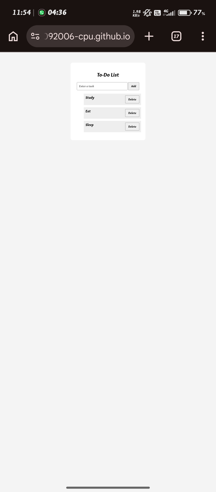

📝 To-Do List

A simple and responsive To-Do List Web Application built using HTML, CSS, and JavaScript. This project helps users organize and manage their daily tasks through a clean and easy-to-use interface.

🚀 Live Demo

https://jeyabharathy30092006-cpu.github.io/To-Do-List/

✨ Features
- ➕ Add new tasks
- ✅ Mark tasks as completed
- 🗑️ Delete tasks
- 📋 Manage daily tasks
- 🎨 Clean and user-friendly interface
- 📱 Responsive design
- ⚡ Lightweight and fast

🛠️ Technologies Used
- HTML5 – Structure of the application
- CSS3 – Styling and responsive design
- JavaScript – Task management and user interactions

📂 Project Structure

To-Do-List
  * index.html
  * style.css
  * script.js
  * todo.jpg
  * README.md

⚙️ How to Run
1. Clone the Repository
git clone:
https://github.com/jeyabharathy30092006-cpu/To-Do-List.git
2. Open the Project
Open the project folder in Visual Studio Code.
3. Run the Application
Open "index.html" in your web browser.

🎯 Project Objective

The main objective of this project is to develop a simple task management application while practicing frontend development concepts such as:
- HTML page structure
- CSS styling
- JavaScript programming
- DOM manipulation
- Event handling
- Task management
- Responsive web design

🔮 Future Enhancements
- 💾 Add Local Storage
- ✏️ Edit existing tasks
- 🔍 Search tasks
- 🗂️ Add task categories
- 📅 Add due dates
- 🔔 Add task reminders
- 🌙 Add dark/light mode

📸 Screenshot

👩‍💻 Author

Jeya Bharathy

Computer Science and Engineering Student

🔗 Project Links

Live Demo:
https://jeyabharathy30092006-cpu.github.io/To-Do-List/

GitHub Repository:
https://github.com/jeyabharathy30092006-cpu/To-Do-List

⭐ Support

If you like this project, consider giving the repository a ⭐ on GitHub.
